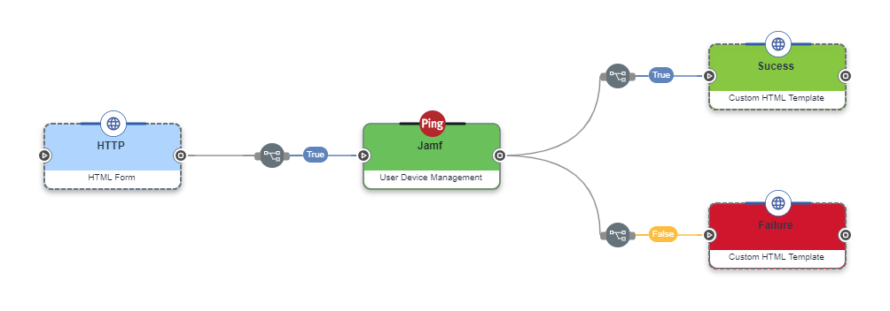

# Jamf Connector

# Introduction

Jamf is a comprehensive management system for Apple macOS computers and iOS devices. Jamf connector developed for Davinci allows you to:

1. User Device Management
2. Make Custom API Call

# Setup

## Resources

For information and setup help, see the following sections of the Jamf documentation:

- [Jamf API Documentation](https://developer.jamf.com/jamf-pro/reference/classic-api)
- [Generate API Token](https://developer.jamf.com/jamf-pro/reference/post_v1-auth-token)
- APIs called in User Device Management Capability to fetch device details
  - [Finds Users by ID](https://developer.jamf.com/jamf-pro/reference/findusersbyid)
  - [Finds Users by Name](https://developer.jamf.com/jamf-pro/reference/findusersbyname)
  - [Finds Computer Devices by ID](https://developer.jamf.com/jamf-pro/reference/findcomputersbyid)
  - [Finds Mobile Devices by ID](https://developer.jamf.com/jamf-pro/reference/findmobiledevicesbyid)

## Requirements

To use the connector, you'll need:

- Jamf Account and API Access

## Setting up the connector

In Davinci, add a **Jamf** connection via the "Connections" tab in your Davinci Environment. For help, see [Adding a connection](https://docs.google.com/document/d/1Sc9tD5tn9dl79qOWup0k3eKk5hrNVI8lZPAdm8loeiA/edit#).

### Connector Settings

Once you've added the Jamf connection click on it's logo, or click the "···" button and edit. You will see the connector's details pop-up. On the GENERAL tab, enter below details:

1. Jamf Username
2. Jamf Password
3. Jamf Server Name

and click apply. This ensures that whenever you use this connector you will not have to reenter this information and token generated using above parameters is used to authorize all capabilities in flow.

# Using the connector in a flow

## User Device Management

To get the list of Mobile/Computer device details that are owned by the user add a Jamf Connector in the flow studio. Then choose the User Device Management capability. Provide the parameters(User ID/Username) from previous nodes in the flow (HTML form) and submit the details.

## Make Custom API Call

To make an API call that is not available as a capability in the connector add a Jamf Connector in the flow studio. Then choose the Make Custom API Call capability. Provide the below properties from previous nodes in the flow (HTML form) and submit the details.

- Custom API End point (API path excluding Domain endpoint)
- Custom API Query parameters
- Custom API Request body
- Custom API Headers
- Custom API Method

# Capabilities

### User Device Management (UserDeviceManagement)

Device Object

#### Attribute `dropDown` `required`

choose an option

 - User ID
 - User Name

#### Identifier `textField` `required`

Identifier

---

### Make Custom API Call (makeCustomAPICall)

Make Custom API Call

#### EndPoint `textField` `required`

End Point of URL

#### Method `dropDown` `required`

The HTTP Method

 - GET
 - POST
 - PUT
 - DELETE
 - PATCH

#### Headers `keyValueList`

Add HTTP headers and provide their values.

#### Data `codeEditor`

The raw JSON body, such as '{ 'Username': 'jsmith@example.com', 'ProfileId': '00e8a0000024zkjAAA' }'.

#### Query Parameters `keyValueList`

Add query parameters and provide their values

---

# Limitations

Use of connector is limited by the availability of Jamf API and account access.
